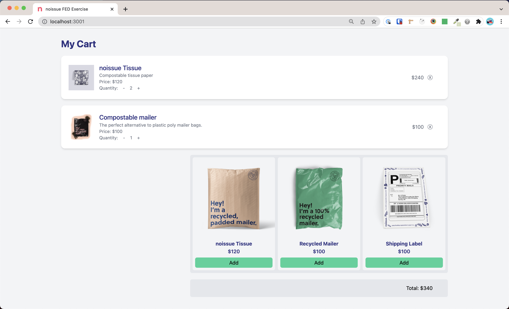

# noissue FED Exercise - Cart Modifications

This practical exercise is to be completed by candidates applying for frontend development roles. It is intended to allow the candidate to demonstrate their coding skills.

## Exercise requirements

A basic cart has been implemented in React using [Create-React-App](https://reactjs.org/docs/create-a-new-react-app.html#create-react-app) and [Tailwind css](https://tailwindcss.com/docs/installation) as the base css framework.

The Product team has requested the following new features to be added.

1. Add a remove button on the right side of each cart item. When clicked, the cart item is removed from the list. (Note there is no need to make any api calls, just modify the cartItems state)

2. Add a way to modify the quantity of each item in the cart. This should update the cost of each cart line item, and the total price.

3. Add an upsell section. If the user clicks on this upsell item, it should be added to the cart list. The images for these upsell products can be found in the `/public/assets/` directory.  
   See design below (Note, we don't expect this to be pixel perfect):

There is also a bug in place where the total does not represent the actual total. Please fix this issue.

The candidate is to **select 2** out of the 3 feature requests and implement them as they would in their regular day to day.
You are welcome to add external packages.
Please add any assumptions or future improvements that you did not get time to do to this readme.

